# 1. 描述
此为Kaggle平台上举办的[Plant Pathology 2020 - CVPR-FGVC7 Competition](https://www.kaggle.com/c/plant-pathology-2020-fgvc7/overview)第一名解决方案，该解决方案来自[yelanlan](https://github.com/yelanlan)并由[nick](https://github.com/NickYi1990)重新实现。其与比赛中提交方案有两点不同：1.训练策略产生最终模型文件的选取方式 2.采用ensemble的策略。故此方案生成的分数和比赛中的分数会略有不同，但也足以获取第一名。

# 2. 如何进行复现
## 2.1 环境数据准备
安装依赖包
```
pip install -r requirements.txt -i https://pypi.mirrors.ustc.edu.cn/simple
```
下载比赛[原始数据集](https://www.kaggle.com/c/plant-pathology-2020-fgvc7/data)，并在data文件夹下进行解压。

## 2.2 运行代码
Step-1 : 用五折交叉验证训练模型。
```terminal
python train.py --train_batch_size 32 --gpus 0 1
```

Step-2 : 产生soft-label用于后期自蒸馏的训练，你可以从这步获得名为"submission.csv"的文件，提交这个文件能获得第四名的成绩，具体分数为 public:0.97988 | private:0.98108。
```terminal
python generate_soft_labels.py
```

Step-3 : 用soft-label和hard-label进行训练外加五折交叉验证训练模型。
```terminal
python train.py --train_batch_size 32 --gpus 0 1 --soft_labels_filename soft_labels.csv --log_dir logs_submit_distill
```

Step-4 : 产生自蒸馏的模型预测的结果，你可以从这步获得名为"submission_distill.csv"的文件，提交这个文件能获得第三名的成绩，具体分数为 public:0.98422 | private:0.98135。
```terminal
python generate_distlled_submission.py
```

Step-5 : 融合结果，提交融合后的文件能获得第一名的成绩，具体分数为 public:0.98354 | private:0.98253。
```python
s1 = pd.read_csv("submission.csv")
s2 = pd.read_csv("submission_distill.csv")
s3 = s1.copy()
s3.iloc[:, 1:] = (s1.iloc[:, 1:] + s2.iloc[:, 1:]) / 2
s3.to_csv("submission_mix.csv", index=False)
```

# 3. 解题技术路径
## 3.1 背景介绍
### 赛题数据集
本次竞赛数据集包含1821张训练图像和1821张测试图像，每张图片有四种可能的标签（健康、锈病、痂并、同时拥有两种疾病），这四种类型的比例为6：1：6：6，是一个数据不平衡问题，且数据集中有一部分不准确标签。针对数据量少以及标签不准确的问题，我们采用了数据增强和知识蒸馏的问题来进行处理。

### 评价指标
赛题采用mean column-wise ROC AUC作为评价指标来衡量模型的性能，该指标为各类标签ROC AUC的平均值。

## 3.2 数据预处理
### 数据增强
由于竞赛数据集相对较小，直接使用原始数据进行训练会导致模型存在过拟合的风险，为了更好的增加模型鲁棒性，我们对数据集进行了一系列增强操作来扩充原始数据集。
#### 随机光照增强
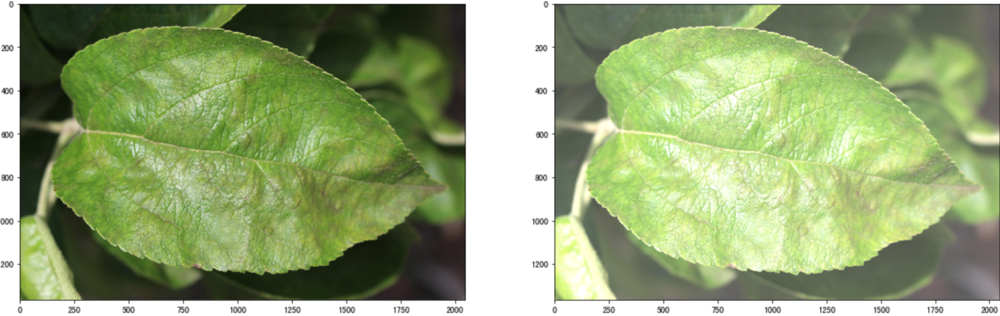
#### 随机对比度增强
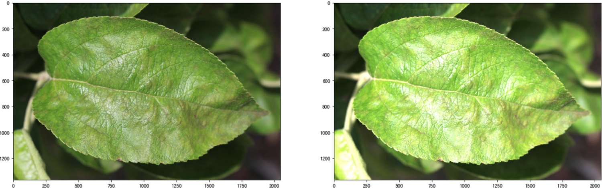
#### 上下翻转
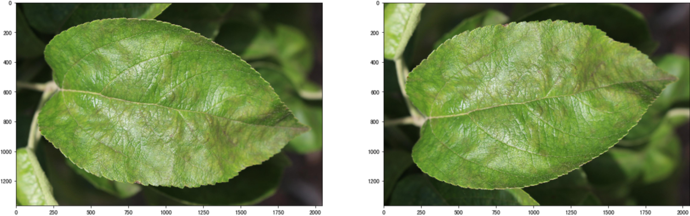
#### 左右翻转
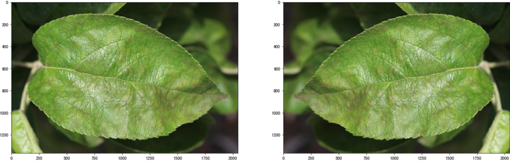
#### 随机旋转缩放
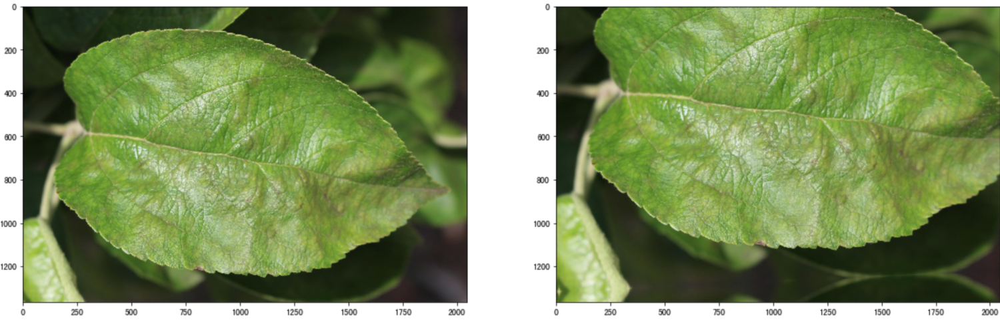
此外还有一些高斯模糊等肉眼不容易区分的增强操作，这些操作可以极大的丰富训练数据集，让模型尽可能的学习更多的特征来增强其泛化程度。
```python
from albumentations import (
    Compose,
    Resize,
    OneOf,
    RandomBrightness,
    RandomContrast,
    MotionBlur,
    MedianBlur,
    GaussianBlur,
    VerticalFlip,
    HorizontalFlip,
    ShiftScaleRotate,
    Normalize,
)
train_transform = Compose(
    [
        Resize(height=image_size[0], width=image_size[1]),
        OneOf([RandomBrightness(limit=0.1, p=1), RandomContrast(limit=0.1, p=1)]),
        OneOf([MotionBlur(blur_limit=3), MedianBlur(blur_limit=3), GaussianBlur(blur_limit=3),], p=0.5,),
        VerticalFlip(p=0.5),
        HorizontalFlip(p=0.5),
        ShiftScaleRotate(
            shift_limit=0.2,
            scale_limit=0.2,
            rotate_limit=20,
            interpolation=cv2.INTER_LINEAR,
            border_mode=cv2.BORDER_REFLECT_101,
            p=1,
        ),
        Normalize(mean=(0.485, 0.456, 0.406), std=(0.229, 0.224, 0.225), max_pixel_value=255.0, p=1.0),
    ]
)
```

## 3.3 模型选型
对于模型，我们采用了seresnext50的模型框架，其中前缀se为squeeze and excitation的过程，这个过程的原理为通过控制scale的大小，把重要的特征增强，不重要的特征减弱，和attention原理相同，目的是让提取的特征指向性更强，从而能更好的对FGVC(Fine-Grained Visual Categorization 细粒度视觉分类)任务中精细的特征做识别。
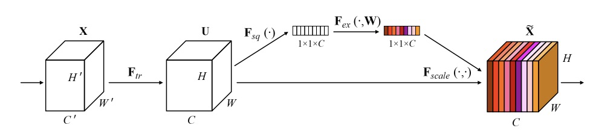
## 3.4 训练策略
我们采用了adam + cycle learning rate的学习策略进行模型的训练，这种学习策略通常不会有太多过拟合，也不需要仔细的调参，非常推荐大家尝试。
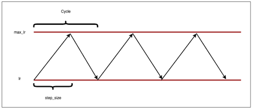
## 3.5 误差分析
误差分析是迭代深度学习中十分重要的一个环节，当训练的模型完成后，如何对模型的性能进行改进才是提分的关键点，我们通过对热力图的方式将模型对标签关键的识别部位提取出来，这样就能很清晰的知道模型主要看到了哪些部位才将图片识别为对应的类型，当我们把识别错误的图片拿出来分析后，就可以知道数据增强的改进点和网络训练的改进点。
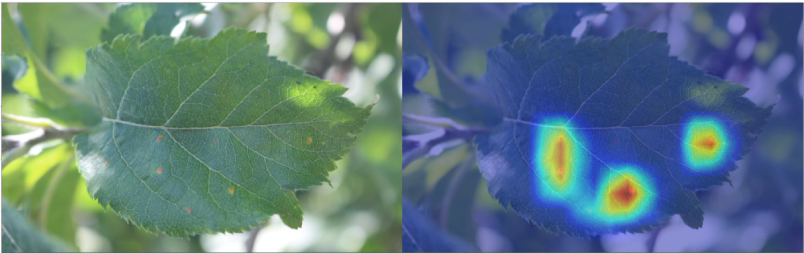
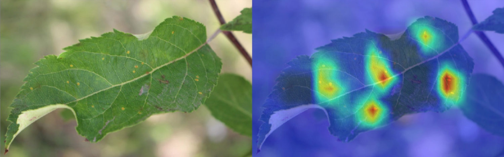
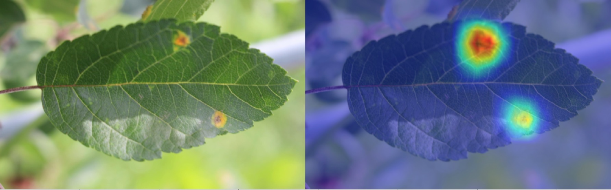
## 3.6 自蒸馏
由于疾病之间有些较难被区别，从而导致标签中存在一些不准确的情况，这给训练增加了一定的难度，我们的模型很可能被这些不准确的标签给误导，为了应对这种情况的出现，我们采用了自蒸馏的方式来解决该问题，我们训练了五折模型，然后将五折的验证集组成out-of-fold文件，最后将out-of-fold的结果和groundtruth label按3：7混合作为训练新模型的标签，简单的描述即为给每个软化了之前的标签，给与每个标签一定的概率，进而减少了模型训练的难度。
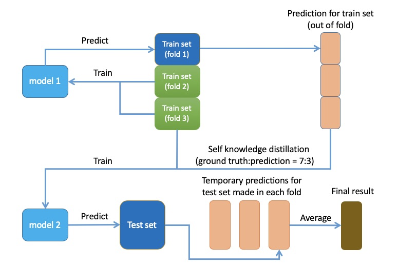
## 3.7 模型预测
在最后提交成绩的阶段，我们采用了TTA（Test Time Augmentation）的策略，对预测样本都做了一定的数据增强，然后对这些增强的预测值做了平均加权，这也给我的结果起到了一定的提升。
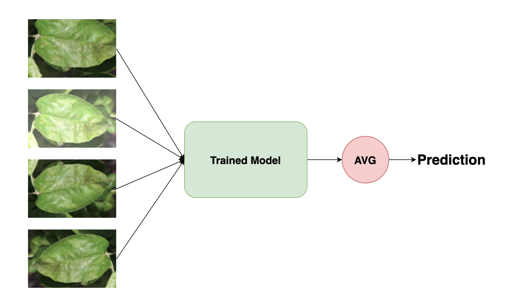